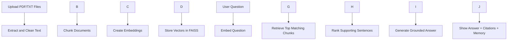

# DocuMind AI

A Python-only RAG (Retrieval-Augmented Generation) project for fresher AI engineer portfolios.

DocuMind AI lets users upload PDFs or text files, build a searchable knowledge base, ask questions, retrieve relevant chunks, and get grounded answers with citations — all without writing any frontend JavaScript.

## Why this project is good for your resume

* Built an end-to-end **RAG pipeline** using **Python**, **Streamlit**, **Sentence Transformers**, and **FAISS**
* Implemented **document ingestion, chunking, embeddings, semantic retrieval, session memory, and grounded answer generation**
* Added **source citations**, **document summary**, and **chat-style interface** to improve usability and trust

## Features

* Upload multiple PDF and TXT files
* Clean document extraction and metadata tracking
* Smart chunking with overlap
* Sentence-transformer embeddings
* Fast semantic search using FAISS
* Grounded answer generation from retrieved chunks
* Top-chunk citations
* Auto-generated document summary
* Chat history + session memory
* Clean Python-only UI with Streamlit

## Project structure

```text
pdf\_rag\_assistant/
├── app.py
├── run\_cli.py
├── requirements.txt
├── .gitignore
├── README.md
├── data/
│   └── .gitkeep
├── .streamlit/
│   └── config.toml
└── src/
    ├── \_\_init\_\_.py
    ├── answerer.py
    ├── chunker.py
    ├── config.py
    ├── document\_loader.py
    ├── embeddings.py
    ├── memory.py
    ├── summarizer.py
    ├── utils.py
    └── vector\_store.py
```

## Architecture



## Tech stack

* Python
* Streamlit
* Sentence Transformers
* FAISS (CPU)
* scikit-learn
* PyPDF
* NumPy

## Setup

### 1\) Create virtual environment

**Windows**

```bash
python -m venv .venv
.venv\\Scripts\\activate
```

**macOS/Linux**

```bash
python -m venv .venv
source .venv/bin/activate
```

### 2\) Install requirements

```bash
pip install -r requirements.txt
```

### 3\) Run app

```bash
streamlit run app.py
```

### 4\) Run CLI version

```bash
python run\_cli.py
```

### 5\) Run all at once on windows powershell(Terminal window)

.\\.venv\\Scripts\\python.exe -m streamlit run app.py

## How to use

1. Launch the Streamlit app.
2. Upload one or more PDF/TXT files.
3. Click **Build knowledge base**.
4. Review the generated document summary.
5. Ask questions in the chat box.
6. Inspect retrieved chunks in the sidebar expander for traceability.

